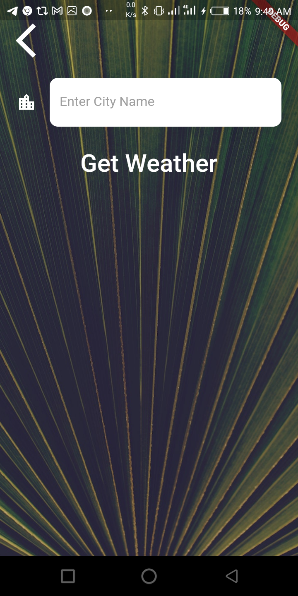

# clima_flutterapp

Welcome to the Weather App, a simple application built using the Flutter framework for learning purposes. This app allows users to check the current weather conditions for any location around the world.

## Getting Started:

* Install the Flutter SDK and set up your development environment by following the instructions on the Flutter website.

* Clone or download the repository from GitHub.

* Open the project in your preferred code editor and navigate to the 'lib' folder.

Run the following command in your terminal to install the necessary packages:

```javascript
Copy code
* flutter packages get
* Replace the API key in the 'lib/services/weather.dart' file with your own OpenWeatherMap API key. You can sign up for a free API key on the OpenWeatherMap website.

* Connect your device or run an emulator and run the following command in your terminal:

* flutter run
Features:

* The app displays the current weather conditions for a location, including temperature, humidity, and wind speed.
* The user can search for any location around the world by entering the city name or zip code.
* The app uses the OpenWeatherMap API to retrieve weather data.```
Note:
This is a sample project for learning purpose. You can use this as a reference to start your own project but please be aware this may not be production ready.


using flutter run



This project is a starting point for a Flutter application.

A few resources to get you started if this is your first Flutter project:

- [Lab: Write your first Flutter app](https://flutter.dev/docs/get-started/codelab)
- [Cookbook: Useful Flutter samples](https://flutter.dev/docs/cookbook)

For help getting started with Flutter, view our
[online documentation](https://flutter.dev/docs), which offers tutorials,
samples, guidance on mobile development, and a full API reference.
